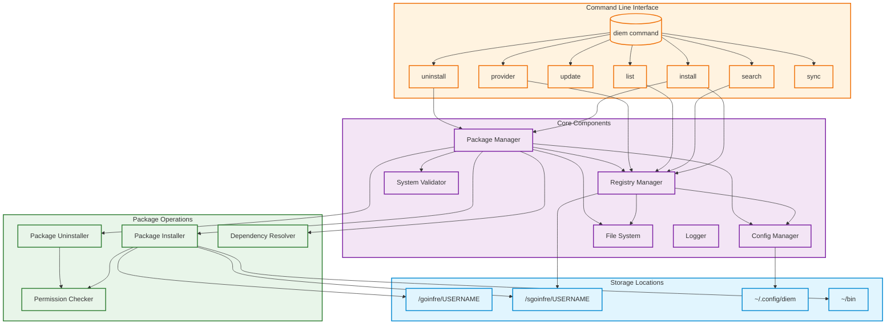

<h1 align="center">
  
</h1>

<p align="center">
  <i align="center">Diem Is an Environment Manager</i> for students of 42
</p>

<h4 align="center">
  <a href="https://profile.intra.42.fr/users/elagouch"></a>
  
  
  
</h4>

## Current State



> [!WARNING]
> This project is in early development and not ready for production use. Below is a comprehensive list of current limitations, issues, and planned improvements.

## Known Issues and Limitations

### 🔒 Security
- [ ] Limited package signature verification
- [ ] Basic sandboxing for install scripts needs improvement
- [ ] No package source verification beyond checksums
- [ ] Missing validation against trusted registries
- [ ] No security policy in place

### 🏗 Architecture
- [ ] Heavy dependency on 42 School's specific infrastructure (/sgoinfre, /goinfre)
- [ ] Missing update mechanism
- [ ] Incomplete dependency resolution
- [ ] No version conflict resolution
- [ ] Unimplemented sync functionality
- [ ] Simple registry system with scaling limitations
- [ ] Poor separation between package metadata and content
- [ ] Missing caching strategy
- [ ] No cleanup mechanism for temporary files
- [ ] Undefined versioning strategy for registry format

### 💻 Technical Debt
- [ ] Multiple unimplemented features (TODOs)
- [ ] Basic error handling
- [ ] Limited test coverage
- [ ] Code duplication in package management
- [ ] No performance optimization
- [ ] Limited error recovery mechanisms

### 🚀 Missing Features
- [ ] Vulnerability checking
- [ ] Limited architecture support
- [ ] No rollback mechanism
- [ ] Limited logging and telemetry
- [ ] No package configuration support
- [ ] Limited package type support
- [ ] No parallel installation
- [ ] No download resumption
- [ ] No package caching
- [ ] No dry-run options
- [ ] Limited search capabilities
- [ ] No interactive mode
- [ ] No shell completion
- [ ] No plugin system

### 📦 Package Management
- [ ] No development dependencies support
- [ ] Limited optional dependencies handling
- [ ] No peer dependencies support
- [ ] Basic package script support
- [ ] No private registry support

### 🌍 Environment
- [ ] Limited environment isolation
- [ ] No multi-environment support
- [ ] Missing environment export/import
- [ ] No environment validation

### 🔧 Infrastructure
- [ ] Missing CI/CD pipeline
- [ ] No automated testing setup
- [ ] No release automation
- [ ] No monitoring capabilities
- [ ] No analytics implementation

### 🌐 Networking
- [ ] Basic HTTP client implementation
- [ ] No retry logic
- [ ] Limited timeout handling
- [ ] Missing proxy support

### 📚 Documentation
- [ ] Missing package author documentation
- [ ] No registry provider documentation
- [ ] Limited API documentation
- [ ] No contribution guidelines
- [ ] Missing code of conduct

## Roadmap

### Phase 1: Core Functionality
- [ ] Complete basic package installation
- [ ] Implement proper signature verification
- [ ] Add comprehensive testing
- [ ] Improve error handling
- [ ] Implement update mechanism
- [ ] Add proper logging

### Phase 2: Security & Stability
- [ ] Enhance package verification
- [ ] Improve sandbox security
- [ ] Implement rollback mechanism
- [ ] Add caching system
- [ ] Implement proper cleanup

### Phase 3: Features & Usability
- [ ] Add parallel installation
- [ ] Implement dependency resolution
- [ ] Add configuration system
- [ ] Implement shell completion
- [ ] Add interactive mode

### Phase 4: Documentation & Community
- [ ] Complete documentation
- [ ] Add contribution guidelines
- [ ] Implement security policy
- [ ] Create package author guides
- [ ] Add registry provider documentation

## Contributing

This project is currently in early development and contributions are welcome. However, please note that many core features are still being implemented.

### Development Setup

```bash
# Clone the repository
git clone https://github.com/yourusername/diem.git
cd diem

# Enter development environment (requires Nix)
nix-shell

# Build the project
cargo build
```

### Before Contributing

1. Check the issues page for ongoing work
2. Read through the known limitations above
3. Consider focusing on high-priority items from the roadmap
4. Contact maintainers before starting major changes

## Installation

```bash
# Installation instructions will be added when project reaches alpha stage
```

## Usage

```bash
# Usage instructions will be added when project reaches alpha stage
```

## License

MIT License - see [LICENSE](LICENSE) for details

<p align="center">
  <a href="https://en.wikipedia.org/wiki/Carpe_diem"><i align="center"><sub>Carpe Diem 🤘</sub></i></a>
</p>
